# Lambda Layer for Tokenization and Encryption of Sensitive Data

In this module, we will learn on how to use [Lambda Layers](https://docs.aws.amazon.com/lambda/latest/dg/configuration-layers.html) to streamline development for Serveless applications. Lambda Layers package dependencies and custom runtime which can be imported by Lambda Function. This module is designed to enable development of applications by loosely coupling security from the application so that only security team has access to sensitive data. Application team can develop applications which can import the Lambda Layer provided by security team. This eases the development and reuse of code across teams. 

## Tokenization vs Encryption 

Tokenization is an alternative to encryption that helps to protect certain parts of the data that has high sensitivity or a specific regulatory compliance requirement such as PCI. Separating the sensitive data into its own dedicated, secured data store and using tokens in its place helps you avoid the potential cost and complexity of end-to-end encryption. It also allows you to reduce risk with temporary, one-time-use tokens. [More Info](https://aws.amazon.com/blogs/database/best-practices-for-securing-sensitive-data-in-aws-data-stores/)

## How? 

We will use [AWS Key Management Service](https://docs.aws.amazon.com/kms/latest/developerguide/overview.html) to create and control the encryption keys. We will then create [customer managed master  key](https://docs.aws.amazon.com/kms/latest/developerguide/concepts.html#master_keys) which will be used by [DynamoDB](https://docs.aws.amazon.com/amazondynamodb/latest/developerguide/Introduction.html) client encryption library to encrypt the plain text. We will also use CloudFormation template to create DynamoDB Table and Lambda Layer which contains  encryption logic and dependent libraries. This Lambda Layer will be imported into Lambda Function which handles the request and response for our application. The application gets the sensitive data (for example, credit card information) from the end user, passes it to Lambda function that invokes the imported layer to exchange sensitive data with unique token. This token is stored in application database (DynamoDB) and the sensitive data is stored by Lambda Layer in separate database (DynamoDB) which can be managed by security team. When required, the encrypted data can be decrypted by providing the token stored in the application database.

This repository has the following directories:
- *src/encryption_keys* - This folder contains the CloudFormation template to create customer managed master key.
- *src/tokenizer*  - This folder contains: 
  * CloudFormation template for creating Lambda Layer and DynamoDB table
  * script to [compile and install required dependencies for Lambda layer](https://docs.aws.amazon.com/lambda/latest/dg/configuration-layers.html#configuration-layers-path)
  * code for encrypting and decrypting provided sensitive data using [DynamoDB encryption client library](https://docs.aws.amazon.com/dynamodb-encryption-client/latest/devguide/what-is-ddb-encrypt.html).
- *src/CustomerApp* - This folder contains: 
  * CloudFormation template to create DynamoDB table, [Lambda Function](https://docs.aws.amazon.com/lambda/latest/dg/welcome.html), APIs in [API Gateway](https://docs.aws.amazon.com/apigateway/latest/developerguide/welcome.html), [Cognito User Pool](https://docs.aws.amazon.com/cognito/latest/developerguide/cognito-user-identity-pools.html) and [Cognito Application Client](https://docs.aws.amazon.com/cognito/latest/developerguide/user-pool-settings-client-apps.html). 
  * code for *simple ordering application* 

## AWS services used in this module
 1. [AWS Lambda](https://docs.aws.amazon.com/lambda/latest/dg/welcome.html)
 2. [Amazon API Gateway](https://docs.aws.amazon.com/apigateway/latest/developerguide/welcome.html)
 3. [Amazon DynamoDB](https://docs.aws.amazon.com/amazondynamodb/latest/developerguide/Introduction.html)
 4. [Amazon Cognito](https://docs.aws.amazon.com/cognito/latest/developerguide/what-is-amazon-cognito.html)
 5. [AWS Cloud9](https://docs.aws.amazon.com/cloud9/latest/user-guide/welcome.html)
 6. [AWS Key Management Service](https://docs.aws.amazon.com/kms/latest/developerguide/overview.html)
 
 
 ## Pre-requisites 
 1. Access to the above mentioned AWS services within AWS Account
 2. Familiarity with **python**  programming language is recommended as the application code is written in python.
 3. Cloud9 Environment, Customer Managed KMS Key and S3 bucket has been created.
 
 **Note** - It is recommended to save the output values from the steps to some TextEditor for use in later steps.
 
 ## Architecture Diagram
 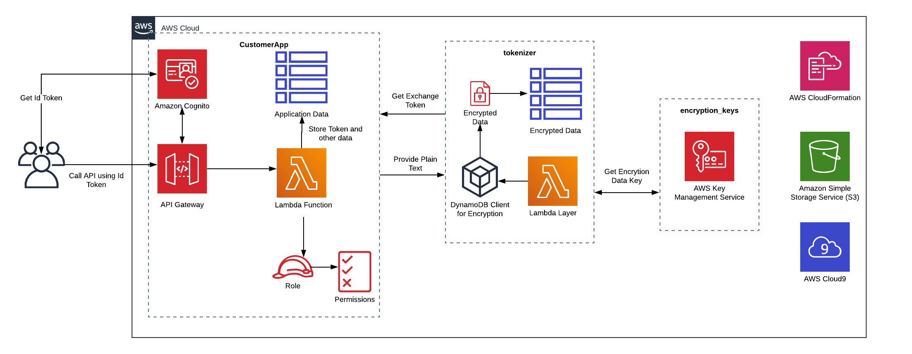
 
## Step 1. Get the values of existing S3 Bucket and Customer Managed Key 

**Step 1.1** Get *S3 Bucket Name* and take a note of it for later steps

```bash
aws s3 ls
```
The output will look like 

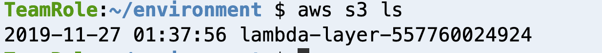

**Step 1.2** Get `Arn` value from the output and take a note of it for later steps

```bash
export kms_alias=`aws kms list-aliases | grep 'mod-' | grep "AliasName" | cut -d'/' -f2 | cut -d'"' -f1`
aws kms describe-key --key-id alias/$kms_alias
```
The output will look like 

```json
{
    "KeyMetadata": {
        "Origin": "AWS_KMS", 
        "KeyId": "********************", 
        "Description": "Customer managed key to be used for dynamo items encryption", 
        "KeyManager": "CUSTOMER", 
        "Enabled": true, 
        "KeyUsage": "ENCRYPT_DECRYPT", 
        "KeyState": "Enabled", 
        "CreationDate": 1574833193.111, 
        "Arn": "arn:aws:kms:*****************", 
        "AWSAccountId": "************"
    }
}
```

## Step 2: Create Lambda Layer for String Tokenization and Encrypted Data Store

**Step 2.1** Go to tokenizer directory 

```bash
cd /home/ec2-user/environment/lambda-layer-tokenization/src/tokenizer/
```

**Step 2.2** Open the file `ddb_encrypt_item.py` and update the value of the variable `aws_cmk_id` with the output value of `Arn` noted in Step 1.2 above and save the file. 

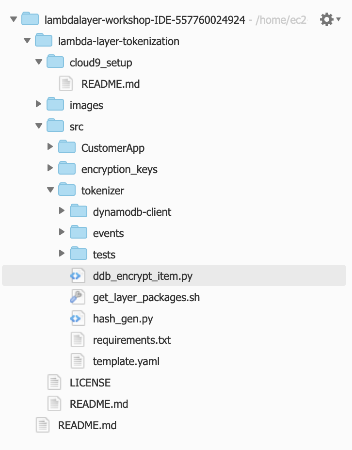

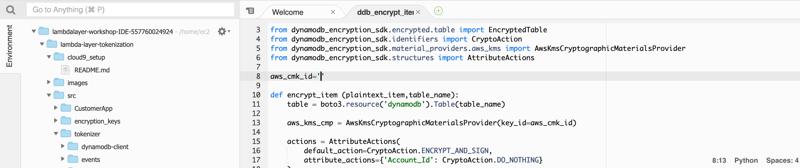


As part of Lambda Layer creation, we need dependent libraries for the application code `ddb_encrypt_item.py` to run. Since the libraries are Operating System (OS) dependent, they have to be compiled on native OS supported by Lambda.

**Step 2.3** Check the dependent libraries mentioned in `requirements.txt` file

```bash
cat requirements.txt 
```
The output will look like 

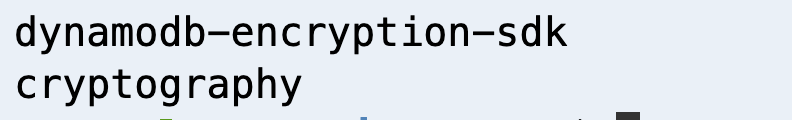


**Step 2.4** Run the script to compile and install the dependent libraries in *dynamodb-client/python/* directory. For Lambda Function, we can include `--use container` in `sam build` command to achieve this but for Lambda Layer, we need to download the Lambda docker image to compile dependent libraries for Amazon Linux Image. [More details on this](https://github.com/pyca/cryptography/issues/3051?source=post_page-----f3e228470659----------------------)

```bash
./get_layer_packages.sh
```

The output will look like 
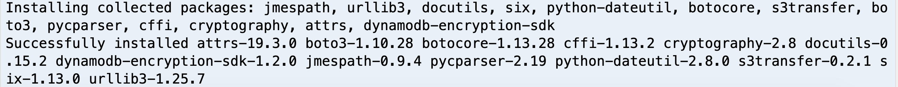

**Step 2.5** Copy the python files `ddb_encrypt_item.py` and `hash_gen.py` to *dynamodb-client/python/*. This is required since Lambda Layer expects files to be in a specific directory to be used by Lambda function. [More details on this](https://docs.aws.amazon.com/lambda/latest/dg/configuration-layers.html#configuration-layers-path)

`ddb_encrypt_item.py` – This file contains the logic to encrypt and decrypt the plain text and store encrypted information in DynamoDB table.

`hash_gen.py` - This file contains the logic to create UUID tokens for strings which will be provided to the end application in exchange for sensitive data, for example, credit card. 

```bash
cp ddb_encrypt_item.py dynamodb-client/python/
```

```bash
cp hash_gen.py dynamodb-client/python/
```

**Step 2.6** Build the SAM template (template.yaml)

```bash
sam build --use-container 
```

After the build is successful, the output will look like 

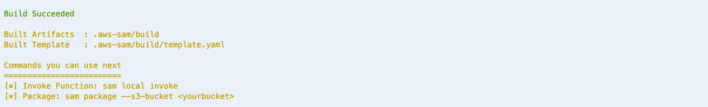

**Step 2.7** Package the code and push to S3 Bucket. Replace `unique-s3-bucket-name` with the value identified in Step 1.1

```bash
sam package --s3-bucket <unique-s3-bucket-name> --output-template-file packaged.yaml
```
 
The output will look like 

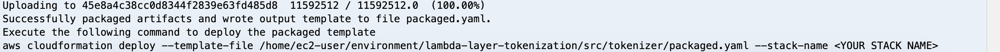

**Step 2.8** Create CloudFormation stack using the below code to create resources and deploy your code. Wait for the stack creation to complete. Note the name of the stack is `tokenizer-stack`

```bash
sam deploy --template-file ./packaged.yaml --stack-name tokenizer-stack
```

The output will look like 
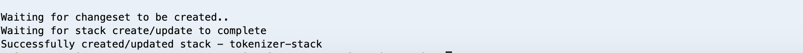

**Step 2.9** Get the output variables of the stack

```bash
aws cloudformation describe-stacks --stack-name tokenizer-stack
```

The output will look like 

```json
"Outputs": [
                {
                    "Description": "ARN for the published Layer version", 
                    "ExportName": "TokenizeData", 
                    "OutputKey": "LayerVersionArn", 
                    "OutputValue": "***********"
                }, 
                {
                    "Description": "ARN for DynamoDB Table", 
                    "OutputKey": "DynamoDBArn", 
                    "OutputValue": "***********/CreditCardTokenizerTable"
                }

            ]
```

Note the *OutputValue* of `LayerVersionArn` and `DynamoDBArn` from the output for later steps.

Here, in Step 2, the CloudFormation stack created DynamoDB table to store encrypted data as well as Lamda Layer for encrypting/decrypting the sensitive data and generating unique tokens for sensitive data.

## Step 3: Create Serverless Application 

Let’s build the Serveless application which contains API gateway for API management, Lambda Function for application code, Lambda Layer to import reusable code that we created earlier and Cognito user pool for API authentication

**Step 3.1** Go to CustomerApp directory which has Serverless Application code and SAM template.
 
 ```bash
 cd /home/ec2-user/environment/lambda-layer-tokenization/src/CustomerApp/
 ```
 
**Step 3.2** Build SAM template 

```bash
sam build --use-container 
```

After the build is successful, the output will look like 


**Step 3.3** Package the code and push to S3 Bucket. Replace `unique-s3-bucket-name` with the value identified in Step 1.1

```bash
sam package --s3-bucket <unique-s3-bucket-name> --output-template-file packaged.yaml
```
 
The output will look like 
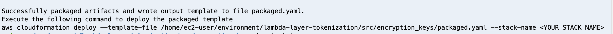

**Step 3.4** Create CloudFormation stack to deploy code and resources to AWS using the packaged.yaml. Note the name of the stack is `app-stack`. 

Replace the parameters with previously noted values for `LayerVersionArn` (Step 2.9), `Arn` (Step 1.2)  and `DynamoDBArn` (Step 2.9)

```bash
sam deploy --template-file ./packaged.yaml --stack-name app-stack --capabilities CAPABILITY_IAM --parameter-overrides layerarn=<LayerVersionArn> kmsid=<Arn> dynamodbarn=<DynamoDBArn>
```
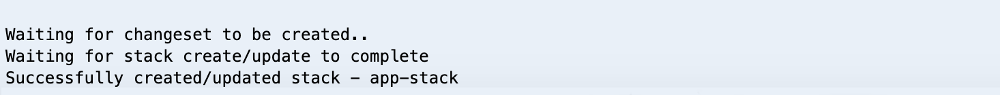

**Step 3.5** Get the output variables of the stack

```bash
aws cloudformation describe-stacks --stack-name app-stack
```

The output will look like

```json
"Outputs": [
                {
                    "Description": "Customer Order Lambda Function ARN", 
                    "OutputKey": "CustomerOrderFunction", 
                    "OutputValue": "*******************:app-stack-CustomerOrderFunction*******"
                }, 
                {
                    "Description": "API Gateway endpoint URL for CustomerOrderFunction", 
                    "OutputKey": "PaymentMethodApiURL", 
                    "OutputValue": "https://*****************/dev/"
                }, 
                {
                    "Description": "AWS Account Id", 
                    "OutputKey": "AccountId", 
                    "OutputValue": "********"
                },
                {
                    "Description": "User Pool App Client for wer application", 
                    "OutputKey": "UserPoolAppClientId", 
                    "OutputValue": "********************"
                }, 
                {
                    "Description": "Region", 
                    "OutputKey": "Region", 
                    "OutputValue": "*************"
                }

            ]
```
Note the *OutputValue* of *OutputKey* `PaymentMethodApiURL` , `AccountId` , `UserPoolAppClientId` and `Region` from the output for later steps.


**Step 3.6** Create a Cognito user with the following code. Replace `Region` and `UserPoolAppClientId` with values noted in  the previous step. Also, provide a **valid** email in place of `user-email` and `password`. Note: you should have access to the email provided to get the verification code. The password should be minimum 6 characters long, should contain at least one lower case and one upper case character.  

```bash
aws cognito-idp sign-up --region <Region> --client-id <UserPoolAppClientId> --username <user-email> --password <password>
```
The output will look like 

```json
{
    "UserConfirmed": false, 
    "UserSub": "************", 
    "CodeDeliveryDetails": {
        "AttributeName": "email", 
        "Destination": "<user-email>", 
        "DeliveryMedium": "EMAIL"
    }
}
```

**Step 3.7** Lets verify the Cognito user we just created  

**Note** – Replace `CONFIRMATION_CODE_IN_EMAIL` with the verification code recieved in the email provided in the previous step. 

```bash
aws cognito-idp confirm-sign-up --client-id <UserPoolAppClientId>  --username <user-email> --confirmation-code <CONFIRMATION_CODE_IN_EMAIL>
```

**Note** – There will be no output for this command.

**Step 3.8** Generate ID token for API authentication. Replace `UserPoolAppClientId` with value noted in step 3.5. Also replace `user-email` and `password` with the same values provided in step 3.6. 

```bash
aws cognito-idp initiate-auth --auth-flow USER_PASSWORD_AUTH --client-id <UserPoolAppClientId> --auth-parameters USERNAME=<user-email>,PASSWORD=<password>
```

The output will look like 

```json 
{
    "AuthenticationResult": {
        "ExpiresIn": 3600, 
        "IdToken": "*********", 
        "RefreshToken": "******", 
        "TokenType": "Bearer", 
        "AccessToken": "********"
    }, 
    "ChallengeParameters": {}
}
```
Note the value of `IdToken` from the output for next steps.


Now, we will invoke APIs to test the application. There are two APIs - 
1. **order** - The first API i.e. *order* is to create the customer order, generate the token for credit card number (using Lambda Layer) and store encrypted credit card number in another DynamoDB table called `CreditCardTokenizerTable` (as specified in the Lambda Layer) and finally store the customer information along with the credit card token in DynamoDB table called `CustomerOrderTable`. 
2. **paybill** - The second API i.e. *paybill* takes the `CustomerOrder` number and fetches credit card token from  `CustomerOrderTable` and calls decrypt method in Lambda Layer to get the deciphered credit card number. 

**Step 3.9** Let's call */order* API to create the order with the following code. Replace the value of `PaymentMethodApiURL` (Step 3.5) and `IdToken` (Step 3.8) with the values identified in the previous steps. 

```bash
curl -X POST \
 <PaymentMethodApiURL>/order \
-H 'Authorization: <IdToken>' \
-H 'Content-Type: application/json' \
-d '{
"CustomerOrder": "123456789",
"CustomerName": "Amazon Web Services",
"CreditCard": "0000-0000-0000-0000",
"Address": "Reinvent2019, Las Vegas, USA"
}'
```

The output will look like 

```json
{"message": "Order Created Successfully", "CreditCardToken": "*************"}
````

**Step 3.10** Let's call */paybill* API to pay the bill using the previously provided information. Replace the value of `PaymentMethodApiURL` (Step 3.5) and `IdToken` (Step 3.8) with the values identified in the previous steps. 

```bash
curl -X POST \
 <PaymentMethodApiURL>/paybill \
-H 'Authorization: <IdToken>' \
-H 'Content-Type: application/json' \
-d '{
"CustomerOrder": "123456789"
}'
```

The output will look like 

```json
{"message": "Payment Submitted Successfully", "CreditCard Charged": "0000-0000-0000-0000"}
````

Application has created the customer order with required details and saved the plain text information (generated credit card token) in DynamoDB table called `CustomerOrdeTable` and encrypted `CreditCard` information is stored in another DynamoDB table called `CreditCardTokenizerTable`. Now, check the values in both the tables to see what items are stored. 

**Step 3.11 [OPTIONAL VERIFICATION]** Get the items stored in `CustomerOrdeTable`

```bash
aws dynamodb get-item --table-name CustomerOrderTable --key '{ "CustomerOrder" : { "S": "123456789" }  }'
```

The output will look like 

```json
{
    "Item": {
        "CustomerOrder": {
            "S": "123456789"
        }, 
        "Address": {
            "S": "Reinvent2019, Las Vegas, USA"
        }, 
        "CustomerName": {
            "S": "Amazon Web Services"
        }, 
        "CreditCardToken": {
            "S": "**********"
        }
    }
}
```

Note the value of `CreditCardToken`. It will be the generated token value and not actual `CreditCard` provided by the end user.

**Step 3.12 [OPTIONAL VERIFICATION]** Get the items stored in `CreditCardTokenizerTable`. Replace the value of `CreditCardToken` (Step 3.11) and `AccountId` (Step 3.5) with previously identified values.

```bash
aws dynamodb get-item --table-name CreditCardTokenizerTable --key '{ "Hash_Key" : { "S": "<CreditCardToken>" }, "Account_Id" : { "S" : "<AccountId>" }  }'
```

The output will look like 

```json
{
    "Item": {
        "*amzn-ddb-map-sig*": {
            "B": "**************"
        }, 
        "*amzn-ddb-map-desc*": {
            "B": "**************"
        }, 
        "Hash_Key": {
            "S": "***************"
        }, 
        "Account_Id": {
            "S": "***************"
        }, 
        "CandidateString": {
            "B": "*****************"
        }
    }

```

Note the value of `CandidateString`. It will be the encrypted value of `CreditCard` instead of the plain text. 

Here, in this step, CloudFormation stack created DynamoDB table for storing customer order information, Lambda function for handling request and response, imported Lambda Layer created in the earlier step, APIs for creating order and paying bill and Cognito user pool for API authentication. In order to verify application functionality, we created a Cognito user to call the APIs and validated plain text (generated token) in `CustomerOrderTable` and encrypted credit card information in `CreditCardTokenizerTable` DynamoDB tables.  

## Step 4: Clean up and delete the resources

Delete the two CloudFormation stacks created (Steps 2 and 3).

```bash
aws cloudformation delete-stack --stack-name app-stack

aws cloudformation delete-stack --stack-name tokenizer-stack
```


## Resources

See the [AWS SAM developer guide](https://docs.aws.amazon.com/serverless-application-model/latest/developerguide/what-is-sam.html) for an introduction to SAM specification, the SAM CLI, and serverless application concepts.
