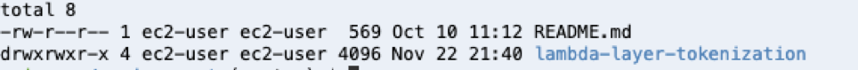
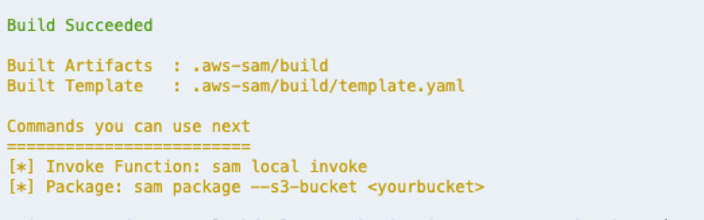

# Lambda Layer for Tokenization and Encryption of Sensitive Data

This session is designed to familiarize you with how to use [Lambda Layers](https://docs.aws.amazon.com/lambda/latest/dg/configuration-layers.html). In this session, you will create solve a common problem for generating token for sensitive data within your application and store encrypted data. You will use [AWS Key Management Service](https://docs.aws.amazon.com/kms/latest/developerguide/overview.html) to create [customer managed master  key](https://docs.aws.amazon.com/kms/latest/developerguide/concepts.html#master_keys) which will be used by DynamoDB client encryption library to generate [encryption data keys](https://docs.aws.amazon.com/kms/latest/developerguide/concepts.html#data-keys) and this code will be packed into Lambda Layer. This Lambda Layer will be imported into simple ordering application. The application gets the sensitive data from the end user and invokes the imported method to generate unique token to be stored in application database and pass the sensitive data to be stored in encrypted format in another database. When required, this encrypted data will be decrypted by providing the unique token with the required abstraction from the application. 

- src/encryption_keys - This folder contains the cloud formation template to create KMS key
- src/tokenizer  - This folder contains the cloud formation template for creating Lambda Layer and [DynamoDB](https://docs.aws.amazon.com/amazondynamodb/latest/developerguide/Introduction.html) table, [compile and install required dependencies for Lambda layer](https://docs.aws.amazon.com/lambda/latest/dg/configuration-layers.html#configuration-layers-path) and code for encrypting and decrypting provided strings using [DynamoDB encryption client library](https://docs.aws.amazon.com/dynamodb-encryption-client/latest/devguide/what-is-ddb-encrypt.html).
- src/CustomerApp - This folder contains the cloud formation template to create DynamoDB table, [Lambda Function](https://docs.aws.amazon.com/lambda/latest/dg/welcome.html), [API Gateway](https://docs.aws.amazon.com/apigateway/latest/developerguide/welcome.html), [Cognito User Pool](https://docs.aws.amazon.com/cognito/latest/developerguide/cognito-user-identity-pools.html) and [Cognito Application Client](https://docs.aws.amazon.com/cognito/latest/developerguide/user-pool-settings-client-apps.html). It also contains the code for the application when required APIs are invoked through API Gateway. 

## AWS Services Used
 1. [AWS Lambda](https://docs.aws.amazon.com/lambda/latest/dg/welcome.html)
 2. [Amazon API Gateway](https://docs.aws.amazon.com/apigateway/latest/developerguide/welcome.html)
 3. [Amazon DynamoDB](https://docs.aws.amazon.com/amazondynamodb/latest/developerguide/Introduction.html)
 4. [Amazon Cognito](https://docs.aws.amazon.com/cognito/latest/developerguide/what-is-amazon-cognito.html)
 5. [AWS Cloud9](https://docs.aws.amazon.com/cloud9/latest/user-guide/welcome.html)
 6. [AWS Key Management Service](https://docs.aws.amazon.com/kms/latest/developerguide/overview.html)
 
 
 ## Pre-requisite 
 1. Access to the above mentioned AWS services within AWS Account
 2. This lab assumes that you have logged in as root account into AWS account. If not, then you need to update key policy under template.yaml file under encryption_keys folder. Replace the keyword 'root' with your user in this file.
 3. This lab uses **python**  programming language for Lambda Layer and Lamnda Function application code.
 
 ## Environment Setup
 This Lab uses AWS Cloud9 as IDE. Complete the Cloud9 Setup in your environment using this [guide](cloud9_setup/README.md)
 
 ## Create S3 Bucket
 We need [Amazon S3](https://docs.aws.amazon.com/AmazonS3/latest/dev/Welcome.html) bucket for [AWS SAM](https://docs.aws.amazon.com/serverless-application-model/latest/developerguide/what-is-sam.html). We are going to use AWS SAM in this lab to build and deploy SAM templates (template.yaml). Note that you need to use a unique name for your S3 bucket. Replace unique-s3-bucket-name with the required value.
 
 ```bash
 aws s3 mb s3://<unique-s3-bucket-name>
 ```
 
 ## Initial and Clone Git into Cloud9 Environment
 
 Use the below commands to initialize and clone the git repository
 
 `git init`
 `git clone https://github.com/anujag24/lambda-layer-tokenization.git`
 
 Once the git repository is cloned, check the directories on the cloud9 environment. Sample output below-
 
 
 
 ## Create Customer Managed KMS Key
 
Go to encryption_keys directory

`cd lambda-layer-tokenization/src/encryption_keys`
 
Build the SAM template (template.yaml) under the directory

`sam build --use-container`
 
After the build is successful, below is the output


 
Package the SAM template to push the code to S3 Bucket

`sam package --s3-bucket <unique-s3-bucket-name> --output-template-file packaged.yaml`
 
Expected Output

```Successfully packaged artifacts and wrote output template to file packaged.yaml```

Deploy the stack using below command. Note the name of the stack is **kms-stack**

`sam deploy --template-file ./packaged.yaml --stack-name kms-stack`

Expected Output 

```Successfully created/updated stack - kms-stack```

Check the output variables for the stack and note the **OutputValue** of  **OutputKey** **KMSKeyID** from the output

`aws cloudformation describe-stacks --stack-name kms-stack`

Sample Output

```json
"Outputs": [
                {
                    "Description": "ARN for CMS Key created", 
                    "OutputKey": "KMSKeyID", 
                    "OutputValue": "*********"
                }
            ]
```
In this step, you have created customer managed KMS key and gave permissions to the root user to access the key to perform all operations. This master encryption key will be used to generate data encryption keys for encrypting items later in the lab. 

## Lambda Layer for String Tokenization and Encrypted Data Store
In this section, we will use the customer managed master key created in the earlier stack to create the lambda layer which will be used by application teams to generate token for sensitive data string such as credit card, etc. 

```bash
cd ../tokenizer/
```

Open the file ddb_encrypt_item.py and update the value of the variable **aws_cmk_id** and save the file

```bash
vi ddb_encrypt_item.py
```

As part of Lambda Layer creation, we need dependent libraries for the application code (ddb_encrypt_item.py) to be installed and provided as part of the lambda layer package. Since the libraries are Operating System (OS) dependent so they have to be compiled on native OS supported by Lambda.

Check the dependent libraries mentioned in requirements.txt file

```bash
cat requirements.txt 
```

Sample Output – 

```bash
dynamodb-encryption-sdk
cryptography
```

Run the script to compile and install the dependent libraries in **dynamodb-client/python/** directory. [More Details on this](https://github.com/pyca/cryptography/issues/3051?source=post_page-----f3e228470659----------------------)

```bash
./get_layer_packages.sh
```

Copy the python file to dynamodb-client/python/ which is required for Lambda layer. Lambda layer expects files to be in a specific directory so that it can be used by Lambda function. [More details](https://docs.aws.amazon.com/lambda/latest/dg/configuration-layers.html#configuration-layers-path)

```bash
cp ddb_encrypt_item.py dynamodb-client/python/
```

```bash
cp hash_gen.py dynamodb-client/python/
```

Build SAM template 

```bash
sam build --use-container 
```

Package the SAM template to push the code to S3 Bucket

```bash
sam package --s3-bucket <unique-s3-bucket-name> --output-template-file packaged.yaml
```
 
Expected Output

```Successfully packaged artifacts and wrote output template to file packaged.yaml```

Deploy the stack using below command. Note the name of the stack is **tokenizer-stack**

```bash
sam deploy --template-file ./packaged.yaml --stack-name tokenizer-stack
```

Check the output variables for the stack and note the **OutputValue** of **TokenizeData** and **DynamoDBArn** from the output

```bash
aws cloudformation describe-stacks --stack-name tokenizer-stack
```

Sample Output

```json
"Outputs": [
                {
                    "Description": "ARN for the published Layer version", 
                    "ExportName": "TokenizeData", 
                    "OutputKey": "LayerVersionArn", 
                    "OutputValue": "***********"
                }, 
                {
                    "Description": "ARN for DynamoDB Table", 
                    "OutputKey": "DynamoDBArn", 
                    "OutputValue": "***********/CreditCardTokenizerTable"
                }

            ]
```

## Serverless Application API for Order Creation and Payment Submission 

 
 
 


## Resources

See the [AWS SAM developer guide](https://docs.aws.amazon.com/serverless-application-model/latest/developerguide/what-is-sam.html) for an introduction to SAM specification, the SAM CLI, and serverless application concepts.

Next, you can use AWS Serverless Application Repository to deploy ready to use Apps that go beyond hello world samples and learn how authors developed their applications: [AWS Serverless Application Repository main page](https://aws.amazon.com/serverless/serverlessrepo/)
